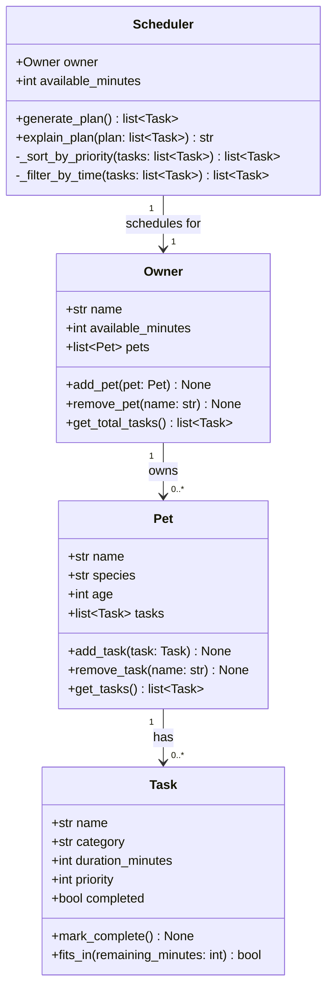

# PawPal+ Project Reflection

## 1. System Design

**a. Core user actions**

The three core actions a user should be able to perform in PawPal+ are:

1. **Add or edit a pet profile** — The user enters basic information about their pet (name, species, age) and about themselves as an owner (name, available time per day). This gives the app the context it needs to tailor a care plan to that specific animal and owner schedule.

2. **Add, edit, or remove care tasks** — The user creates individual tasks (such as a morning walk, feeding, medication, or grooming session), specifying the task name, estimated duration, and priority level. This task list becomes the raw input the scheduler works from.

3. **Generate and view a daily care plan** — The user triggers schedule generation, and the app produces an ordered daily plan that fits within the owner's available time window, prioritizing higher-priority tasks first. The plan is displayed clearly so the owner knows exactly what to do and, ideally, why each task was included or excluded.

**b. Initial design**

The initial design uses four classes:

- **Owner** — holds the owner's name and their total daily time budget (in minutes). Responsible for owning a collection of pets and producing a schedule request.
- **Pet** — holds the pet's name, species, and age. Belongs to an Owner and owns a list of Tasks.
- **Task** — holds everything about a single care activity: name, category (walk/feed/meds/etc.), estimated duration in minutes, priority level (1–5), and a completion flag. Can mark itself complete and report whether it fits within a remaining time window.
- **Scheduler** — takes an Owner (and their Pet's task list) plus the available time budget and produces an ordered daily plan. Responsible for sorting by priority, fitting tasks into the time window, and generating a plain-language explanation of why each task was included or skipped.

**c. Design changes**

After reviewing the skeleton in `pawpal_system.py` for missing relationships and logic bottlenecks, two issues stood out:

1. **`Scheduler` had no clean path to tasks across multiple pets.** The original UML had `Scheduler → Owner`, but `Scheduler.generate_plan()` would have needed to reach through `owner.pets[i].tasks` directly — coupling it to Pet's internal structure. The fix was to promote `get_all_tasks()` on `Owner` as the single aggregation point. `Scheduler` now calls `owner.get_all_tasks()` and never touches `Pet` directly.

2. **`generate_plan()` returning a bare `list[Task]` created a bottleneck for `explain_plan()`.** To explain which tasks were *skipped* and why, the explainer needs to know what was *not* included — information that is lost once the filtered list is returned. The design was adjusted so that `_filter_by_time()` internally tracks skipped tasks, and `generate_plan()` stores them on the instance (`self._skipped`) so `explain_plan()` can reference them without re-running the algorithm.

- Did your design change during implementation?
- If yes, describe at least one change and why you made it.

---

## 2. Scheduling Logic and Tradeoffs

**a. Constraints and priorities**

- What constraints does your scheduler consider (for example: time, priority, preferences)?
- How did you decide which constraints mattered most?

**b. Tradeoffs**

- Describe one tradeoff your scheduler makes.
- Why is that tradeoff reasonable for this scenario?

---

## 3. AI Collaboration

**a. How you used AI**

- How did you use AI tools during this project (for example: design brainstorming, debugging, refactoring)?
- What kinds of prompts or questions were most helpful?

**b. Judgment and verification**

- Describe one moment where you did not accept an AI suggestion as-is.
- How did you evaluate or verify what the AI suggested?

---

## 4. Testing and Verification

**a. What you tested**

- What behaviors did you test?
- Why were these tests important?

**b. Confidence**

- How confident are you that your scheduler works correctly?
- What edge cases would you test next if you had more time?

---

## 5. Reflection

**a. What went well**

- What part of this project are you most satisfied with?

**b. What you would improve**

- If you had another iteration, what would you improve or redesign?

**c. Key takeaway**

- What is one important thing you learned about designing systems or working with AI on this project?
