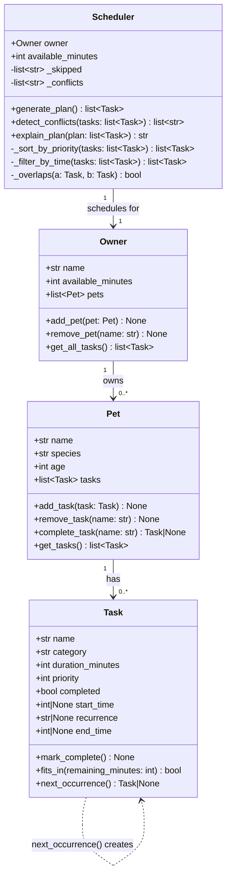

# PawPal+ Project Reflection

## 1. System Design

**a. Core user actions**

The three core actions a user should be able to perform in PawPal+ are:

1. **Add or edit a pet profile** — The user enters basic information about their pet (name, species, age) and about themselves as an owner (name, available time per day). This gives the app the context it needs to tailor a care plan to that specific animal and owner schedule.

2. **Add, edit, or remove care tasks** — The user creates individual tasks (such as a morning walk, feeding, medication, or grooming session), specifying the task name, estimated duration, and priority level. This task list becomes the raw input the scheduler works from.

3. **Generate and view a daily care plan** — The user triggers schedule generation, and the app produces an ordered daily plan that fits within the owner's available time window, prioritizing higher-priority tasks first. The plan is displayed clearly so the owner knows exactly what to do and, ideally, why each task was included or excluded.

**b. Initial design**

The initial design uses four classes:

- **Owner** — holds the owner's name and their total daily time budget (in minutes). Responsible for owning a collection of pets and producing a schedule request.
- **Pet** — holds the pet's name, species, and age. Belongs to an Owner and owns a list of Tasks.
- **Task** — holds everything about a single care activity: name, category (walk/feed/meds/etc.), estimated duration in minutes, priority level (1–5), and a completion flag. Can mark itself complete and report whether it fits within a remaining time window.
- **Scheduler** — takes an Owner (and their Pet's task list) plus the available time budget and produces an ordered daily plan. Responsible for sorting by priority, fitting tasks into the time window, and generating a plain-language explanation of why each task was included or skipped.

**c. Design changes**

After reviewing the skeleton in `pawpal_system.py` for missing relationships and logic bottlenecks, two issues stood out:

1. **`Scheduler` had no clean path to tasks across multiple pets.** The original UML had `Scheduler → Owner`, but `Scheduler.generate_plan()` would have needed to reach through `owner.pets[i].tasks` directly — coupling it to Pet's internal structure. The fix was to promote `get_all_tasks()` on `Owner` as the single aggregation point. `Scheduler` now calls `owner.get_all_tasks()` and never touches `Pet` directly.

2. **`generate_plan()` returning a bare `list[Task]` created a bottleneck for `explain_plan()`.** To explain which tasks were *skipped* and why, the explainer needs to know what was *not* included — information that is lost once the filtered list is returned. The design was adjusted so that `_filter_by_time()` internally tracks skipped tasks, and `generate_plan()` stores them on the instance (`self._skipped`) so `explain_plan()` can reference them without re-running the algorithm.

---

## 2. Scheduling Logic and Tradeoffs

**a. Constraints and priorities**

The scheduler considers two constraints: total daily time available (the owner's budget in minutes) and task priority (1–5 scale). Time is the hard constraint — a task that does not fit is always skipped regardless of priority. Priority is the soft ordering constraint — among tasks that do fit, higher-priority tasks are always attempted first. This ordering was chosen because missing a medication (priority 5) is more harmful than skipping enrichment (priority 2), so the greedy pass naturally protects the most important tasks.

**b. Tradeoffs**

The greedy algorithm is simple and predictable but suboptimal in one key way: it can exclude a short high-value task in favour of a long lower-value one when time runs out. For example, if a 30-minute walk (priority 5) fills the last slot, a 5-minute medication (also priority 5) added later in the task list gets skipped — even though the medication would have fit if the walk were moved. A true knapsack solver would find the globally optimal subset, but that adds O(n·W) complexity and is harder to explain to a non-technical owner. The greedy approach is reasonable here because tasks are pre-sorted by priority before the time filter runs, so the most important items are tried first and the "good enough" result is transparent and fast.

**c. Readability vs. Pythonic style**

During development, an alternative `_sort_by_priority` using `operator.attrgetter("priority")` was considered — it removes the lambda and is slightly more idiomatic. The lambda version (`key=lambda t: t.priority`) was kept because it reads as plain English and does not require importing an extra module. The performance difference is negligible for the task counts this app handles. Choosing readability over idiom was the right call for a learning context.

---

## 3. AI Collaboration

**a. How you used AI**

AI tools were used at every phase of this project, but with different prompting strategies for each phase:

- **Design brainstorming (Phase 1):** Describing the scenario in plain English and asking for a UML sketch surfaced relationships (e.g., that `Scheduler` should call `owner.get_all_tasks()` rather than reaching into pets directly) that would have taken longer to discover manually.
- **Code generation (Phase 2):** Asking for "skeleton only, no logic" kept the AI from generating implementation details before the design was settled. Prompts like "generate class stubs from this UML using Python dataclasses" produced clean starting points that matched the intended structure.
- **Testing (Phase 3):** Asking "what edge cases should I test for a greedy scheduler?" generated a useful checklist (zero budget, task that exactly fills budget, equal-priority tasks, floating vs. pinned conflict detection) that went beyond what came to mind immediately.
- **Review (Phase 4):** Sharing a completed method and asking "how could this be simplified?" produced a concrete alternative (`operator.attrgetter`) that was easy to evaluate against the original.

The most effective prompts were specific: they included a file reference, named the exact behavior in question, and asked for one thing at a time rather than "generate the whole feature."

**b. Judgment and verification**

When asked how to simplify `_sort_by_priority`, the AI suggested replacing the lambda with `operator.attrgetter("priority")`. This is more idiomatic Python but adds an import and makes the line harder to read for someone who hasn't seen `attrgetter` before. The suggestion was evaluated by asking: *would a reader unfamiliar with the `operator` module understand this immediately?* The answer was no, so the lambda was kept and the reasoning was documented in the reflection instead of silently accepting the "better" version. Verification in this case was a readability audit rather than a test — a good reminder that not all code quality is measurable by pytest.

---

## 4. Testing and Verification

**a. What you tested**

The 25-test suite covers four behavior groups:

1. **Task state** — `mark_complete()` flips the flag; `fits_in()` correctly handles exact-boundary cases (remaining == duration is True, remaining == duration − 1 is False).
2. **Recurrence** — `next_occurrence()` returns a fresh uncompleted copy with all attributes preserved; calling `complete_task()` on an already-done task is a no-op and does not append a duplicate.
3. **Scheduler correctness** — tasks added in arbitrary order come back sorted 5→1; tasks scheduled greedily respect the time budget; a task that exactly fills the budget leaves no room for the next one; zero-budget skips everything.
4. **Conflict detection** — same start time and overlapping windows are flagged; adjacent tasks (end of A == start of B) and floating tasks (no `start_time`) are not flagged.

These behaviors were prioritized because they represent the guarantees the UI promises the user: "your most important tasks come first" and "if two tasks clash, you'll be warned."

**b. Confidence**

Confidence: **★★★★☆**

The scheduler's logic is well-tested at the unit level. The main uncovered area is integration: the Streamlit UI rewrites session state on every interaction, and no tests verify that adding a pet, then adding a task, then generating a plan all work correctly in sequence within a live browser session. Edge cases to add next: tasks whose `recurrence` copy would exceed the budget (the copy should appear in future sessions but be skipped today), and an owner with 10+ pets to verify `get_all_tasks()` performance at scale.

---

## 5. Reflection

**a. What went well**

The separation between the logic layer (`pawpal_system.py`) and the UI layer (`app.py`) worked well from the start. Because all scheduling behavior lived in pure Python classes with no Streamlit dependency, it was possible to write and run 25 automated tests entirely in the terminal without touching the browser. This made debugging fast — a failing test pointed directly to a method, not a UI interaction. The `_skipped` and `_conflicts` instance variables on `Scheduler` were especially useful: storing side-effects on the scheduler rather than returning them from `generate_plan()` kept the UI code simple and let `explain_plan()` produce a complete report without re-running the algorithm.

**b. What you would improve**

The greedy algorithm's biggest weakness — that it can skip a short high-priority task when a long lower-priority one has already consumed the budget — would be worth addressing in a next iteration. A bounded knapsack with a priority-weighted value function would find globally better subsets. The implementation would be more complex, but the `explain_plan()` output could then say "we chose these 4 tasks because they give the highest total priority score within your time budget" — a much more satisfying explanation for an owner who notices their pet's medication was dropped.

**c. Key takeaway**

The most important lesson from this project is that AI tools amplify whatever design process you bring to them — they do not substitute for one. When the design was clear (a UML diagram with named classes and explicit relationships), AI-generated code fit cleanly into the structure. When the design was vague, AI suggestions required significant reworking or introduced coupling that had to be refactored out. The "lead architect" role was not about writing every line of code; it was about knowing the intended shape of the system well enough to recognize when a suggestion fit and when it didn't.
